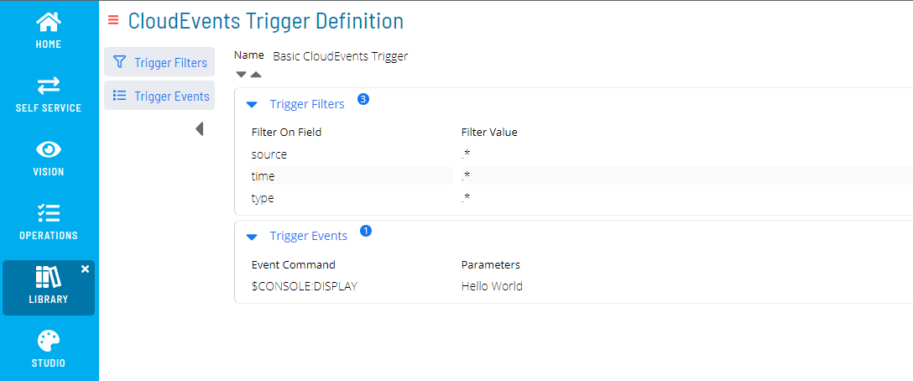
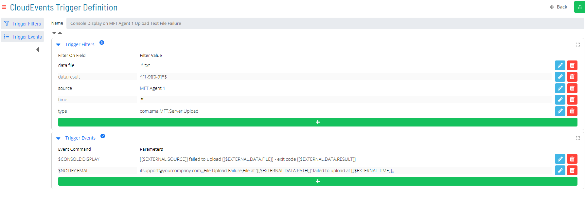

# CloudEvents Triggers

The **CloudEvents Triggers** module allows you to trigger Events within OpCon via externally-produced 'trigger events' which adhere to the [CloudEvents Specification](https://cloudevents.io/).

In it's current form, this module is used exclusively to manage triggering Events in OpCon when certain events happen on the OpCon MFT Server.
For further details regarding this use-case, refer to [MFT Server Triggers](https://help.smatechnologies.com/opcon/agents/opconmft/server-triggers).

### CloudEvents Trigger Format
A CloudEvents Trigger definition is comprised of two components: the `Trigger Filters` and the `Trigger Events`.



#### Trigger Filters
The `Trigger Filters` component enumerates all criteria which any incoming trigger event must satisfy in order to activate the CloudEvents Trigger.
Currently, the only criteria format utilized within this module is string-based Regular Expression matching against incoming trigger event payload fields (partially enumerated below).
A specific filter criteria is therefore comprised of a 'Filter Field' and a 'Filter Value', where the Filter Field is the identifier of the payload attribute which should be filtered against and the Filter Value is the Regular Expression which should be used to evaluate the filter.

The Field identifier should be entered utilizing dot-notation to reference nested data attributes.
For example, if the trigger event is shaped similarly to this:
```
{
  type: 'com.example.exemplarEvent',
  data: {
    'resultCode': 0
  }
}
```
then the Field identifier for the trigger event's `type` attribute is `type`,
while the Field identifier for the trigger event's `resultCode` attribute would be `data.resultCode`.

> Tip: If a filter criteria has been defined against the field `type` and with a known Filter Value (provided in a selection drop-down when entering a Filter Value for this Field),
> then Solution Manager will provide contextual suggestions based upon known trigger event schemas.
> You may always enter a custom Filter Field manually, but specifying a specific Event Type which the filter should apply to will provide the simplest data entry process.

A CloudEvents Trigger definition may contain any number of filter criteria, including none.
When an incoming trigger event is evaluated against a CloudEvents Trigger definition, any attributes which that trigger event has but which are not present in the definition's filter criteria will automatically pass the filter.
This means that a CloudEvents Trigger definition with no defined filters will activate with every trigger event,
or that, if a CloudEvents Trigger is defined with a single filter on the 'source' Field, that Trigger will activate with every event from that source.

In the case that multiple filter criteria are included, all criteria must pass for the CloudEvents Trigger to activate. If it is desired to have just one criteria be sufficient for activation (or some subset of the criteria), then it is recommended to completely define the CloudEvents Trigger with just that subset of the criteria, then utilize the `Copy` functionality to create multiple CloudEvents Trigger Definitions with each Definition having the different desired filter criteria.

#### Trigger Events
The `Trigger Events` component in turn enumerates all OpCon Events which will be queued for processing should an incoming trigger event satisfy all `Filter` criteria.

For more detailed information on OpCon Events and what they are, see [here](https://help.smatechnologies.com/opcon/core/events/introduction).

When configuring OpCon Events in the context of this module, you can click on the magic wand located to the right of any Property field in order to bring up the Property Selector Dialog.
In addition to the standard Property hints available in this dialog, there is an additional set of `$EXTERNAL` Properties which correspond to expected attributes available on an incoming trigger event.
If there is a recognized `type` filter associated with this Trigger Definition, then there will be further `$EXTERNAL.DATA` Properties which align with known attributes available within the trigger event's data payload.
Any `$EXTERNAL` Property will be replaced with the corresponding value from the external triggering event when processing the OpCon Event.


### Trigger Events Data Format (CloudEvents)

This module implements the CloudEvents specification for defining and consuming 'trigger events' - events which are generated outside of the core OpCon application, such as those produced by the MFT Server Agent.
The full specification can be found [here](https://github.com/cloudevents/spec/blob/main/cloudevents/spec.md#overview).

Events adhering to the CloudEvents standard are published in JSON format and can contain the following fields:

 Field Name      | Description                                                          | Type      | Required
 --------------- | -------------------------------------------------------------------- | ------    | --------
 id              | A unique identifier for the event                                    | string    | :white_check_mark:
 source          | An identifier for the context in which the event occurred            | URI       | :white_check_mark:
 specversion     | The version of CloudEvents specification implemented by the producer | string    | :white_check_mark:
 type            | Describes the type of event - defined by the producer                | string    | :white_check_mark:
 data            | Describes any domain-specific information about this event           | string    | :x:
 datacontenttype | Describes the data type of any included event data                   | string    | :x:
 dataschema      | Identifies the schema which any included event data adheres to       | URI       | :x:
 subject         | Identifies the subject of the event, if any                          | string    | :x:
 time            | Timestamp of when the event occurred                                 | timestamp | :x:

 In addition to these fields, it is possible for events following this specification to include additional attributes.
 These are referred to as Extension Attributes within the specification.
 Of particular note is the `data` attribute, which is used to contain domain-specific information about the event occurrence.
 The two attributes `datacontenttype` and `dataschema` describe the encoding and structure of this information respectively.

If `datacontenttype` is `application/json` and a JSON schema is provided in the `dataschema` attribute with an event, the CloudEvents Triggers module will use this information to provide contextual hinting in the module interface in addition to schema validation at the API.

### Filtering Incoming Trigger Events
When a new trigger event is submitted to the Solution Manager API, it is queued for processing against any CloudEvents Triggers which have been defined.

When that trigger event is processed, each defined CloudEvents Trigger is evaluated against the trigger event in turn,
with every filter associated with the CloudEvents Trigger being applied to the trigger event.
If and only if every filter applies to the trigger event will the OpCon Events associated with that specific CloudEvents Trigger be queued for execution.
If the trigger event satisfies the filters defined in multiple CloudEvents Trigger definitions, then each matching CloudEvents Trigger will queue their associated OpCon Events for execution.

Note that filters are not guaranteed to evaluate in sequential order, nor are any OpCon Events which are triggered by a matching trigger event guaranteed to be executed in the same order as displayed.
Furthermore, if the trigger event has matched with multiple CloudEvents Triggers, then all of their OpCon Events will be executed in arbitrary order.

### Examples

#### User Logon Alert


This CloudEvents Trigger will display a console message whenever an OpCon MFT Server user logs onto the server.
Note that the `source` and `time` fields have Filter Values of `.*` - which is the Regular Expression for 'accept any and all input'.
Therefore, even though these fields are technically included in the filter criteria for this Trigger Definition, they will have no influence on whether or not the Trigger activates.
Also note the usage of the `$EXTERNAL` property identifiers to provide contextual information to the display message.

You may notice that the type filter here is displayed as `com.sma.MFT.Server.Logon`, while in the `type` filter selection drop-down this filter would be displayed as `MFT Server Logon`. These two values are equivalent and either can be entered while yielding the same results - the same applies to all other known types.

##### *Matching Trigger Event*
```
{
  "source": "MFT Agent 1",
  "type": "com.sma.MFT.Server.Logon",
  "data": {
    "logonUserName": "User1",
    ...
  },
  ...
}
```

##### *Non-Matching Trigger Event*
```
{
  "source": "MFT Agent 1",
  "type": "com.sma.MFT.Server.Logoff",
  "data": {
    "logonUserName": "User1",
    ...
  },
  ...
}
```

#### Display Message When Text File Upload from Server Fails


This CloudEvents Trigger will display a console message and send a notification e-mail whenever the Server component of MFT Agent 1 fails to upload a .txt file.

You may notice that the type filter here is displayed as `com.sma.MFT.Server.Logon`, while in the `type` filter selection drop-down this filter would be displayed as `MFT Server Logon`. These two values are equivalent and either can be entered while yielding the same results - the same applies to all other known types.

##### *Matching Trigger Event*
```
{
  "source": "MFT Agent 1",
  "type": "com.sma.MFT.Server.Upload",
  "data": {
    "file": "readme.txt",
    "result": 5,
    ...
  },
  ...
}
```

##### *Non-Matching Trigger Events*
```
{
  "source": "MFT Agent 2",
  "type": "com.sma.MFT.Server.Upload",
  "data": {
    "file": "readme.txt",
    "result": 0,
    ...
  },
  ...
},
{
  "source": "MFT Agent 1",
  "type": "com.sma.MFT.Server.Download",
  "data": {
    "file": "readme.txt",
    "result": 0,
    ...
  },
{
  "source": "MFT Agent 1",
  "type": "com.sma.MFT.Server.Upload",
  "data": {
    "file": "readme.txt",
    "result": 0,
    ...
  },
  ...
}
{
  "source": "MFT Agent 1",
  "type": "com.sma.MFT.Server.Upload",
  "data": {
    "file": "readme",
    "result": 10,
    ...
  },
  ...
}
  ...
}
```