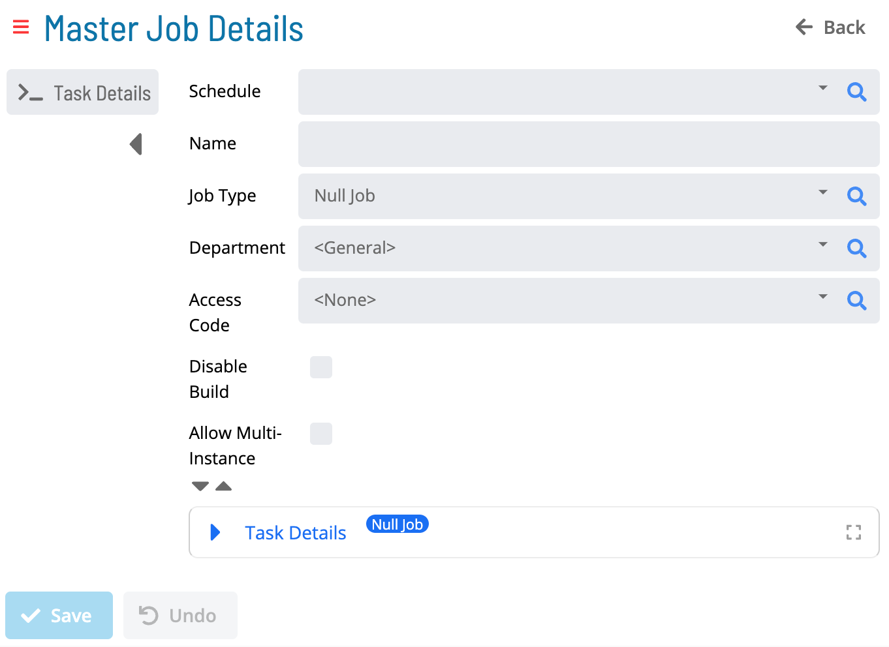

# Overview

The Master Jobs tab allows you to perform functions for managing the master jobs.

Please check back for more content.

# Adding Master Jobs

## Required Privileges

In order to add a master job, you must have at least all of the following privileges:

- **Departmental Function Privilege**: User must be at least in a role
  that has All Function Privileges, Add Jobs To Master Schedules or All Job Master Functions.

---

## Adding a Job

To add a Master Job, go to **Library** > **Master Jobs**.

Select **Add**. The Master Job Details page is displayed:

1. Select a **Schedule**.

1. Enter a **Name**.

1. Select a **Job Type**.

1. Select a **Department**.

1. Select an **Access Code**.

1. _(Optional)_ Select the **Disable Build** checkbox. For more information, refer to [Jobs](../../../../../objects/jobs.md) in the **Concepts** online help.

1. _(Optional)_ Select the **Allow Multi-Instance** checkbox. For more information, refer to [Multi-Instance Jobs](../../../../../operations/job-names.md#multi-instance-jobs) in the **Concepts** online help.

1. Expand the **Task Details** section and enter the **Task Details** according to the **Job Type**.

1. Select **Save**.

---

### Job Types

Select any of the following links to access instructions for defining platform-specific job information:

- [Container Jobs](../../../../../job-types/container.md)
- [File Transfer Jobs](../../../../../job-types/file-transfer.md)
- [Null Jobs](../../../../../job-types/null.md)
- [SAP BW Jobs](../../../../../job-types/sap-bw.md)
- [SAP R/3 and CRM Jobs](../../../../../job-types/sap.md)
- [SQL Jobs](../../../../../job-types/sql.md)
- [Unix Jobs](../../../../../job-types/unix.md)
- [Windows Jobs](../../../../../job-types/windows.md)

---

### Additional Job Information

Select any of the following links to access instructions for defining additional job information:

- [Documentation](../../../../../job-components/documentation.md)
- [Events](../../../../../job-components/events.md)
- [Expression Dependencies](../../../../../job-components/expression-dependencies.md)
- [Frequencies](../../../../../job-components/frequency.md)
- [Instance Properties](../../../../../job-components/instances.md)
- [Job Dependencies](../../../../../job-components/job-dependencies.md)
- [Tags](../../../../../job-components/tags.md)
- [Threshold / Resource Dependencies](../../../../../job-components/threshold-resource-dependencies.md)
- [Threshold / Resource Updates](../../../../../job-components/threshold-resource-updates.md)

# Copying Master Jobs

## Required Privileges

In order to copy a master job, you must have at least all of the following privileges:

- **Departmental Function Privilege**: User must be at least in a role
  that has All Function Privileges, Add Jobs To Master Schedules or All Job Master Functions.

---

## Copying a Job

To copy a job, go to **Library** > **Master Jobs**.

Select a job and select **Copy**. The Master Job Copy dialog is displayed:

1. Enter a **Name**.

1. Select a **Schedule**.

1. Select **OK** to copy the job or **Cancel** to cancel the operation.

# Moving Master Jobs

## Required Privileges

In order to move a master job, you must have at least all of the following privileges:

- **Departmental Function Privilege**: User must be at least in a role
  that has All Function Privileges, Add Jobs To Master Schedules or All Job Master Functions.

---

## Moving a Job

To move a job, go to **Library** > **Master Jobs**.

Select a job and select **Move**. The Master Job Move dialog is displayed:

1. Select a **Schedule**.

1. Select **OK** to move the job or **Cancel** to cancel the operation.

# Viewing Master Job Cross References

To view a Master Job's cross references, go to **Library** > **Master Jobs**. Select a job and select **Cross References**.

# Deleting Master Jobs

## Required Privileges

In order to delete a job, you must be in the ocadm role
or have at least all of the following privileges:

- **Schedule Privilege**: User must be at least in a role that has
  access to the job's parent schedule.
- **Access Code Privilege**: User must be at least in a role that has
  access to the assigned job access code with **Allow job updates**
  flag set to true.
- **Machine / Machine Group Privilege**: User must be at least in a role that has
  access to the assigned job machine or machines in the machine group.
- **Departmental Function Privilege**: User must be at least in a role
  that has All Function Privileges, or Modify Jobs In MasterSchedules, Delete Jobs From Master Schedules or Modify Jobs In Master Schedules privileges and department privilege.
- **Department Privilege**: User must be at least in a role that has
  access to the assigned job department or All Departments.

---

## Deleting a Job

To delete a Master Job, or multiple Master Jobs, go to **Library** > **Master Jobs**.

Select a job or jobs and select **Delete**. A confirmation dialog is displayed:

Select **Yes** to delete the job(s). Select **No** to cancel the operation.
