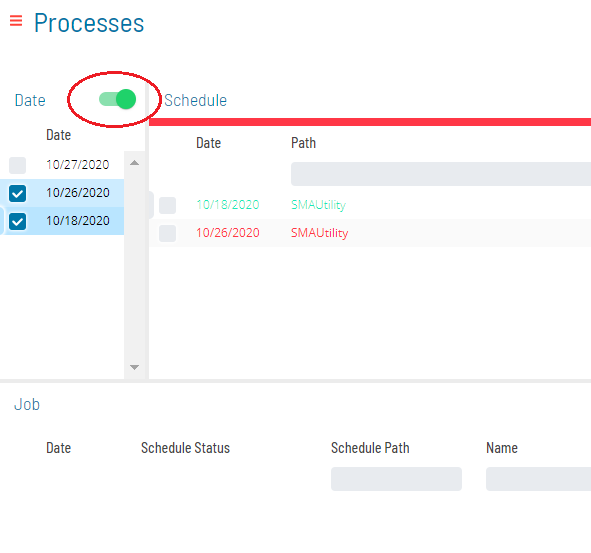
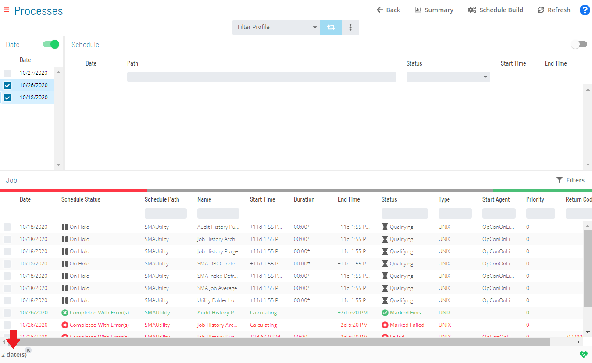
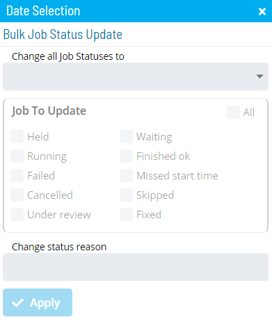
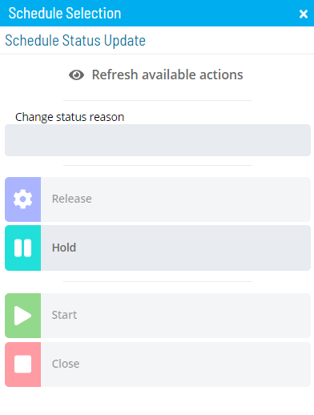
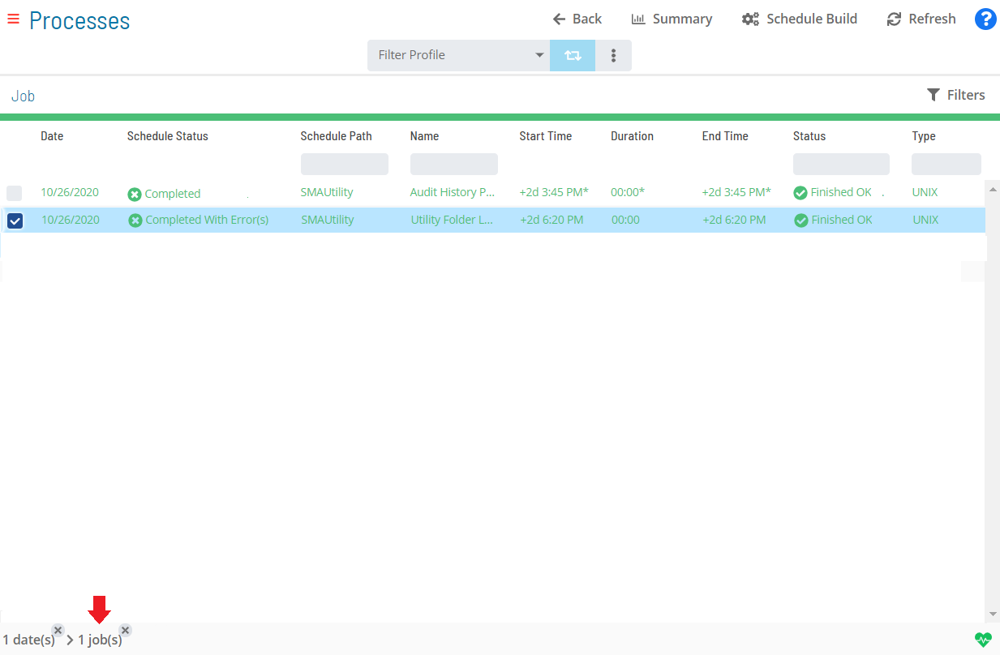
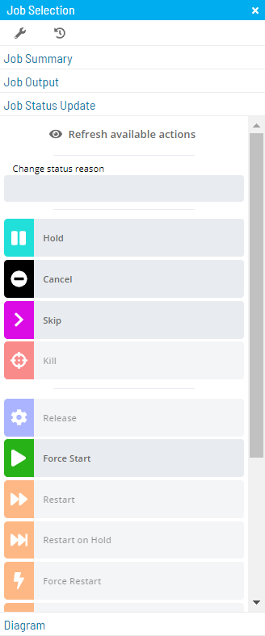

# Schedule and Job Status Changes

# Performing Bulk Job Status Updates (Date Level)

The **Operations** module has made performing mass action on job status
updates at the date level easier. For example, with a few simple steps,
you can update a job's status for a selected date to Mark Finished OK when the job's current state is in Waiting,
Held.

To perform bulk job status updates:

Click on the **Processes** button at the top-right of the **Operations
Summary** page. The **Processes** page will display.

Ensure that the **Date** toggle switch is enabled so that you can make
your date selection. The switch will appear green when enabled.

Select the desired **date(s)** in the list. A record of your
selection(s) will display in the [status bar](SM-UI-Layout.md#Status) at the bottom of the page in the form
of a breadcrumb trail.

Click on the date record (e.g., 3 date(s)) in the status bar to display
the **Selection** panel with the **Bulk Job Status Update** tab in
focus.

:::note
As an alternative, you can right-click on any date selected in the list to display the **Selection** panel.
:::

Select one of the following options in the **Change all Job Statuses
to** drop-down list:

**Cancel**: This option allows you to cancel all jobs for the selected
date(s), based on a filter. Any jobs dependent on cancelled jobs do not
have those dependencies met.

**Hold**: This option allows you to suspend the processing of ALL jobs
associated with the selected date(s), based on a filter.

**Mark Failed**: This option allows you to mark all jobs on the selected
date(s) as Failed, based on a filter.
**Mark Finished OK**: This option allows you to mark all jobs on the
selected date(s) as Finished OK, based on a filter.
**Mark Fixed**: This option allows you to mark all jobs on the selected
date(s) as Fixed, based on a filter.
**Mark Under Review**: This option allows you to mark all jobs on the
selected date(s) as Under Review, based on a filter.

**Release**: This option allows you to place all held jobs on the
selected date(s) back into a Qualifying state, based on a filter. Jobs start as soon as all dependencies are met.

**Restart**: This option allows you to place all jobs on the selected
date(s) back in a Qualifying state, based on a filter. Jobs are started as soon as all dependencies are met.

For Container jobs, additional options are available to perform bulk
Restart operations:

- **Restart**: Restarts the Container job and the subschedule jobs.
    This process will only impact the objects that are one level deep,
    which means that if the subschedule has another Container job, then
    the subschedule jobs associated with that Container job will not be
    restarted.
- **Rebuild**: Restarts the Container job and deletes the subschedule
    associated with it. SAM will then rebuild the subschedule and
    restart all the jobs in it.
- **None**: Applies no action on the subschedule. The subschedule
    remains untouched (neither restarted nor deleted). The Container job
    restarts but closes immediately since there is no action taking
    place on the subschedule.

Keep the following scenarios in mind for performing bulk Restart
operations on Container jobs:

**Scenario 1**: If a single date is selected and that date contains a
single Container job and **Restart** is selected from the **Change all
Job Statuses to** drop-down, then do the following next:

a.  Select the **checkbox(es)** in the **Job To Update** frame for the
    current job status(es) that will undergo the status change---any
    selection will serve as a status filter.
b.  Select one of the three \[action\] buttons that is available for the     Container job: **Restart**, **Rebuild**, or **None**.
c.  Enter or select the change status reason and click **Apply**.

**Scenario 2**: If a single date is selected and that date contains
multiple Container jobs and **Restart** is selected from the **Change
all Job Statuses to** drop-down, then do the following next:

Select the **checkbox(es)** in the **Job To Update** frame for the
current job status(es) that will undergo the status change---any
selection will serve as a status filter.

Follow either Option 1 or Option 2:

- (Option 1) Click on one of the three \[action\]     buttons---**Restart**, **Rebuild**, or **None**---in the **Job
    Containers Action frame** to apply that action to all Container jobs
    associated with that date.
- (Option 2) Click on the **Custom** button in the **Job Containers
    Action frame** to choose which action to perform on the Container
    jobs individually. Clicking **Custom** displays every Container job
    associated with the selected date, each with the **Restart**,
    **Rebuild**, and **None** options. You can then select one of the
    three options for each Container job.

Enter or select the change status reason and click **Apply**.

**Scenario 3**: If multiple dates are selected and the dates contain
multiple Container jobs and **Restart** is selected from the **Change
all Job Statuses to** drop-down, then follow steps a - c of Scenario 2. Keep in mind that clicking the **Custom** button in this
scenario will display each selected date along the Container job(s)
associated with each date.

:::note
To hide the associated Container jobs in the **Job Containers Action** frame, simply click on any of the other three Job Container Actions (Restart, Rebuild, or None).
:::

**Restart on Hold**: This option allows you to place all jobs on the
selected date(s) in an On Hold state on restart, based on a filter.

**Skip**: This option allows you to place all jobs on the selected
date(s) in a Job to be Skipped state until they qualify to start. When the jobs qualify, the jobs are skipped and the
job dependencies of all subsequent jobs will be met.

:::note
For more information about job status changes, refer to [Schedule and Job Status Change Commands](../../../operations/status-change-commands.md) in the **Concepts** online help.
:::

Select the **checkbox(es)** for the current job status(es) that will
undergo the status change. Any selection made in the **Jobs To Update**
frame will serve as a status filter.

:::note
For more information about job statuses and allowed changes, refer to [Schedule and Job Status Descriptions and Allowed Status Changes](../../../operations/status-descriptions.md) in the **Concepts** online help.
:::

*(Optional)* Enter or select a change status reason.

:::note
Depending on application configuration, the **Change Status Reason** drop-down list may store a number of the previous reasons entered for Job or Schedule status updates.
:::

Click **Apply** to apply the job status change.

Close the **Selection** panel when done.

.png "More Info icon")
Related Topics

- [Performing Schedule Status     Changes](Performing-Schedule-Status-Changes.md)
- [Performing Job Status     Changes](Performing-Job-Status-Changes.md)
- [Performing Agent Status     Updates](Performing-Agent-Status-Updates.md)
- [Viewing Job Output](Viewing-Job-Output.md)
- [Viewing Job Configuration](Viewing-Job-Configuration.md)
- [Using PERT View](Using-PERT-View.md)
- [Managing Daily Processes](Managing-Daily-Processes.md)

# Performing Bulk Job Status Updates (Schedule Level)

The **Operations** module has made performing mass action on job status
updates at the schedule level easier. Let's say, for example, that you
wanted to specify the following mass update conditions:

1. Update the job's status to Cancel for the selected schedule when the job's current state is Waiting.
2. Update the job's status to Cancel selected schedule when the job's current state is in Waiting, Held.

This is all possible in **Operations** with a few simple steps.

To perform bulk job status updates:

Click on one of the five operation dials (Failed, Blocked, Waiting,
Running, or Completed) or use the **Quick Search** field (type the
keyword and click **Enter**) in the **Schedules** section on the
**Operations Summary** page.

The **Processes** page will display.

Ensure that both the **Date** and **Schedule** toggle switches are
enabled so that you can make your date and schedule selections,
respectively. Each switch will appear green when enabled.

Select the desired **date(s)** and **schedule(s)** in each respective
list. A record of your selection(s) will display in the [status bar](SM-UI-Layout.md#Status) at the bottom of the page in the form
of a breadcrumb trail.

:::note
Depending on the number of schedules returned in general or after making date selections, you may wish to filter and/or sort the list of schedules to make it easier to make your schedule selections.

For filtering, use the **Filter Bar** just above the list of schedules to filter the list. Type the keyword in the appropriate field and click **Enter**, and the list will filter accordingly.

For sorting, click on the column heading to sort the column in ascending order (indicated by a small arrow pointing down). Click on the column heading again to sort the column in descending order (indicated by a small arrow pointing up).
:::

Click on the schedule record (e.g., 3 schedule(s)) in the status bar to
display the **Selection** panel.

:::note
As an alternative, you can right-click on any schedule selected in the list to display the **Selection** panel.
:::

Select the **Bulk Job Status Update** accordion-style tab in the panel.

Select one of the following options in the **Change all Job Statuses
to** drop-down list:

- **Cancel**: This option allows you to cancel all jobs for the
    selected schedule(s), based on a filter. Any jobs dependent on
    cancelled jobs do not have those dependencies met.
- **Hold**: This option allows you to suspend the processing of ALL
    jobs associated with the selected schedule(s), based on a filter.
- **Mark Failed**: This option allows you to mark all jobs on the
    selected schedule(s) as Failed, based on a     filter.
- **Mark Finished OK**: This option allows you to mark all jobs on the
    selected schedule(s) as Finished OK, based on a     filter.
- **Mark Under Review**: This option allows you to mark all jobs on
    the selected schedule(s) as Under Review, based     on a filter.
- **Mark Fixed**: This option allows you to mark all jobs on the
    selected schedule(s) as Fixed, based on a     filter.
- **Release**: This option allows you to place all held jobs on the
    selected schedule(s) back into a Qualifying     state, based on a filter. Jobs start as soon as all dependencies are
    met.
- **Restart**: This option allows you to place all jobs on the
    selected schedule(s) back in a Qualifying     state, based on a filter. Jobs are started as soon as all
    dependencies are met.
- **Restart on Hold**: This option allows you to place all jobs on the
    selected schedule(s) in an On Hold state on     restart, based on a filter.
- **Skip**: This option allows you to place all jobs on the selected
    schedule(s) in a Job to be Skipped state until     they qualify to start. When the jobs qualify, the jobs are skipped
    and the job dependencies of all subsequent jobs will be met.

:::note
For more information about job status changes, refer to [Schedule and Job Status Change Commands](../../../operations/status-change-commands.md) in the **Concepts** online help.
:::

Select the **checkbox(es)** for the current job status(es) that will
undergo the status change. Any selection made in the **Jobs To Update**
frame will serve as a status filter.

:::note
For more information about job statuses and allowed changes, refer to [Schedule and Job Status Descriptions and Allowed Status Changes](../../../operations/status-descriptions.md) in the **Concepts** online help.
:::

*(Optional)* Enter or select a change status reason.

:::note
Depending on application configuration, the **Change Status Reason** drop-down list may store a number of the previous reasons entered for Job or Schedule status updates.
:::

Click **Apply** to apply the job status change.

Close the **Selection** panel when done.

.png "More Info icon")
Related Topics

- [Performing Schedule Status     Changes](Performing-Schedule-Status-Changes.md)
- [Performing Job Status     Changes](Performing-Job-Status-Changes.md)
- [Performing Agent Status     Updates](Performing-Agent-Status-Updates.md)
- [Viewing Job Output](Viewing-Job-Output.md)
- [Viewing Job Configuration](Viewing-Job-Configuration.md)
- [Using PERT View](Using-PERT-View.md)
- [Managing Daily Processes](Managing-Daily-Processes.md)

# Performing Schedule Status Changes

The **Operations** module allows you to perform schedule status change
using a few simple steps.

To perform schedule status changes:

Click on one of the five operation dials (Failed, Blocked, Waiting,
Running, or Completed) or use the **Quick Search** field (type the
keyword and click **Enter**) in the **Schedules** section on the
**Operations Summary** page.

The **Processes** page will display.

Ensure that both the **Date** and **Schedule** toggle switches are
enabled so that you can make your date and schedule selections,
respectively. Each switch will appear green when enabled.

Select the desired **date(s)** and **schedule(s)** in each respective
list. A record of your selection(s) will display in the [status bar](SM-UI-Layout.md#Status) at the bottom of the page in the form
of a breadcrumb trail.

:::note
Depending on the number of schedules returned in general or after making date selections, you may wish to filter and/or sort the list of schedules to make it easier to make your schedule selections.

For filtering, use the **Filter Bar** just above the list of schedules to filter the list. Type the keyword in the appropriate field and click **Enter**, and the list will filter accordingly.

For sorting, click on the column heading to sort the column in ascending order (indicated by a small arrow pointing down). Click on the column heading again to sort the column in descending order (indicated by a small arrow pointing up).
:::

Click on the schedule record (e.g., 3 schedule(s)) in the status bar to
display the **Selection** panel with the **Schedule Status Update** tab
in focus.

:::note
As an alternative, you can right-click on any schedule selected in the list to display the **Selection** panel.
:::

*(Optional)* Click the **Refresh available actions**
button to verify which status update actions are available for the
current selection. This option is particularly helpful when more than
one schedule has been selected since all status update buttons are
enabled by default.

*(Optional)* Enter or select a change status reason.

:::note
Depending on application configuration, the **Change Status Reason** drop-down list may store a number of the previous reasons entered for Job or Schedule status updates.
:::

Select one of the following status updates to apply to the selected
schedule(s):

:::note
Any status updates that are applied to the Schedule Names selected will effect ALL jobs that are scheduled to run on that specific date (as opposed to "just" the ones that are listed within the current scope being viewed).
:::

- **Release**: This option allows you to release the selected
    schedule(s) from a Held state. Jobs on the     schedule(s) continue processing from the point where they were
    stopped. If there are subschedules under the defined schedule and
    they are in a status of Parent Hold, those     subschedules will also be released.
- **Hold**: This option allows you to suspend the processing of the
    selected schedule(s). All currently running jobs continue to process
    to completion, but no new jobs on the schedule(s) start. If there
    are subschedules under the selected schedule and they are in a
    status of Waiting or In Process, those subschedules are placed in a
    status of Parent Hold.
- **Start**: This option allows you to override the selected
    schedule's start date(s) and time(s), and cause them to run
    immediately. The SAM begins processing the schedule(s) as soon as
    this option is selected. If there are subschedules under the defined
    schedule and they are in a status of Parent Hold, those subschedules will also be started.
- **Close**: This option allows you to mark the selected schedule(s)
    as Completed when the schedule(s) are still In Process only because they contain failed jobs.

:::note
For more information about job status changes, refer to [Schedule and Job Status Change Commands](../../../operations/status-change-commands.md) in the **Concepts** online help.
:::

Close the **Selection** panel when done.

.png "More Info icon")
Related Topics

- [Performing Job Status     Changes](Performing-Job-Status-Changes.md)
- [Performing Bulk Status Job Updates (Schedule     Level)](Performing-Bulk-Job-Status-Updates-Schedule-Level.md)
- [Performing Agent Status     Updates](Performing-Agent-Status-Updates.md)
- [Viewing Job Output](Viewing-Job-Output.md)
- [Viewing Job Configuration](Viewing-Job-Configuration.md)
- [Using PERT View](Using-PERT-View.md)
- [Managing Daily Processes](Managing-Daily-Processes.md)

# Performing Job Status Changes

The **Operations** module allows you to perform job status changes using
a few simple steps.

To perform job status changes:

Click on one of the six operation dials (Failed, Blocked, Waiting,
Running, Completed, or Ignored) or use the **Quick Search** field (type
the keyword and click **Enter**) in the **Jobs** section on the
**Operations Summary** page.

:::note
The "Ignored" operation dial groups any job with a job status of Cancelled or Skipped.
:::

The **Processes** page will display.

*(Optional)* Filter and/or sort the list of jobs
displayed.

Filtering:

a.  For [quick filtering](Managing-Daily-Processes.md#Quick), you
    can use the **Filter Bar** just above the list of jobs to filter the
    list. You simply type the keyword in the appropriate field and click
    **Enter**, and the list will filter accordingly.
b.  For [alternative     filtering](Managing-Daily-Processes.md#Interactive), use the
    interactive color-coded **Statistics Bar** above the list of jobs to
    filter the list by status. Click on any color in the bar to filter
    the view by the current job status.
c.  For more [in-depth     filtering](Managing-Daily-Processes.md#In-depth), you can use
    the 
    button to display the **Filter** panel then filter the list of jobs
    by job status, tag, department, or access code. The filter button
    icon will change to dark yellow and also display the number of
    filters currently turned on ().
    Click on the **x** at the top-right corner of the button to remove
    all selected filters at once.

Sorting:

Click on the column heading to sort the column in ascending order
(indicated by a small arrow pointing down). Click on the column heading
again to sort the column in descending order (indicated by a small arrow
pointing up).

Select any **job(s)** in the list. A record of your selection(s) will
display in the [status bar](SM-UI-Layout.md#Status) at the bottom
of the page in the form of a breadcrumb trail.

Click on the job record (e.g., 1 job(s)) in the status bar to display
the **Selection** panel.

:::note
As an alternative, you can right-click on any job selected in the list to display the **Selection** panel.
:::

Select the **Job Status Update** accordion-style tab in the panel.

*(Optional)* Click the **Refresh available actions**
button to verify which status update actions are available for the
current selection. This option is particularly helpful when more than
one job has been selected since all status update buttons are enabled by
default.

*(Optional)* Enter or select a change status reason.

:::note
Depending on application configuration, the **Change Status Reason** drop-down list may store a number of the previous reasons entered for Job or Schedule status updates.
:::

Select one of the following status updates to apply to the selected
job(s):

- **Hold**: This option allows you to place the selected job(s) on
    hold.
- **Cancel**: This option allows you to cancel the selected job(s).
    The job does not process unless manually started by a user or an
    event.
- **Skip**: This option allows you to place the selected job(s) in a
    Job to be Skipped state until the job(s)     qualify to start. When the job(s) qualify, they are skipped and the
    job dependencies of all subsequent jobs are met.
- **Kill**: This option allows you to send a request to abort one ore
    more jobs on an Agent machine. If the kill is successful, the
    application reports the killed job as Failed.     If the Kill is not successful, the job continues to show a
    Running status in the application.
- **Release**: This option allows you to release the selected job(s)
    from a Held state.
- **Force Start**: This option allows you to force start the selected
    job(s). This causes the job(s) to ignore all dependencies, and to
    start immediately.
- **Restart**: This option allows you to place the selected job(s)
    back in a Qualifying state. All dependencies     must be met before the job(s) are submitted.
- **Restart on Hold**: This option allows you to place the selected
    job(s) back in a Qualifying state, and the     job(s) will process when all dependencies have been met.
- **Force Restart**: This option allows you to force restart the
    selected job(s) and ignore the start time and all dependencies. The
    job(s) restart as soon as this option is selected as long as a
    machine is available.
- **Restart On Step**: This option allows you to select a step on
    which to restart a job. This option can only be triggered if the job
    type supports this feature and there is an available list of steps
    in the database returned by the Agent during runtime.
- **Mark Finished OK**: This option allows you to change the selected
    job(s) to a Finished OK status regardless of     the job's current status. All events are processed as if the job(s)
    had Finished OK without intervention. If a job     is Marked Finished OK before it starts, both
    the start and finish time saved in history equal the time the job is
    marked.
- **Mark Failed**: This option allows you change the selected job(s)
    to a Failed status regardless of the job's     current status. All events are processed as if the job(s) had failed
    without intervention. If a job is Marked Failed     before it starts, both the start and finish time saved in history
    equal the time the job is marked.
- **Mark Under Review**: This option allows you to change the selected
    job(s) to an Under Review status (and being     worked on) when the job is in a Failed, Marked
    Failed, or Initialization Error state.
- **Mark Fixed**: This option allows you to change the selected job(s)
    to Fixed status when the job is in a Failed, Marked Failed,
    Initialization Error, or Under Review state.

:::note
For more information about job status changes, refer to [Schedule and Job Status Change Commands](../../../operations/status-change-commands.md) in the **Concepts** online help.
:::

Close the **Selection** panel when done.

.png "More Info icon")
Related Topics

- [Performing Schedule Status     Changes](Performing-Schedule-Status-Changes.md)
- [Performing Bulk Status Job Updates (Schedule     Level)](Performing-Bulk-Job-Status-Updates-Schedule-Level.md)
- [Performing Bulk Status Job Updates (Date     Level)](Performing-Bulk-Job-Status-Updates-Date-Level.md)
- [Performing Agent Status     Updates](Performing-Agent-Status-Updates.md)
- [Viewing Job Output](Viewing-Job-Output.md)
- [Viewing Job Configuration](Viewing-Job-Configuration.md)
- [Using PERT View](Using-PERT-View.md)
- [Managing Daily Processes](Managing-Daily-Processes.md)
